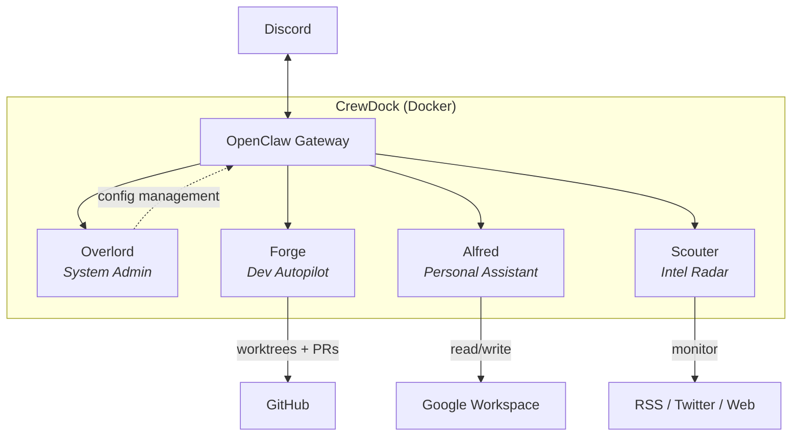

# CrewDock

A self-hosted AI crew that runs 24/7 on your server. Four specialized agents working autonomously in Docker, built on [OpenClaw](https://github.com/openclaw/openclaw).

## Architecture

## What is CrewDock

CrewDock turns a Docker host into a 24/7 AI operations center. It runs
[OpenClaw](https://github.com/openclaw/openclaw) as the gateway, adds four
specialized agents, and wires everything to Discord so you can monitor and
interact from your phone.

The agents run on cron schedules or on demand. Each one has its own workspace,
config, and database. You deploy once and they take it from there.
