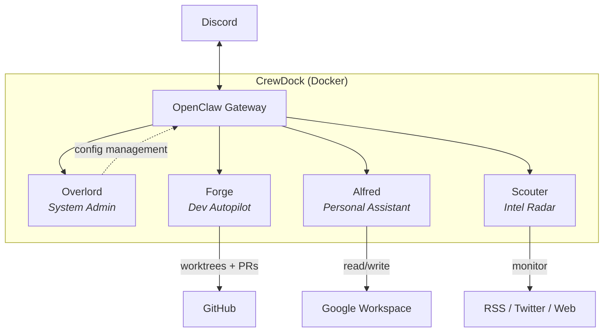

# CrewDock

A self-hosted AI crew that runs 24/7 on your server. Four specialized agents working autonomously in Docker, built on [OpenClaw](https://github.com/openclaw/openclaw).

[](LICENSE)
[](https://www.docker.com/)
[](https://github.com/openclaw/openclaw)

## Architecture



## What is CrewDock

CrewDock turns a Docker host into a 24/7 AI operations center. It runs
[OpenClaw](https://github.com/openclaw/openclaw) as the gateway, adds four
specialized agents, and wires everything to Discord so you can monitor and
interact from your phone.

The agents run on cron schedules or on demand. Each one has its own workspace,
config, and database. You deploy once and they take it from there.

## The Agents

### Overlord — System Admin

Manages agent configuration through the OpenClaw control UI (dashboard).
Adjusts heartbeat schedules, channel bindings, and enabled state for the
other agents. No cron, no Discord channel. Access it via `make dashboard`.

### Alfred — Personal Assistant

Daily briefings and Google Workspace access (Gmail, Calendar, Tasks) via
Discord. On first message, Alfred walks you through setting your briefing
schedule. After that, it delivers a morning summary on cron and answers
workspace queries on demand.

### Forge — Dev Autopilot

Autonomous development agent. Picks up GitHub issues, writes code, and
opens PRs using Claude CLI.

**How it works:**

1. A cron job fires every 15 minutes
2. Forge checks which repos are due based on their schedule
3. For each repo, it fetches open issues (oldest first)
4. Filters out issues with active sessions, existing PRs, or exclude labels
5. Spawns a Claude coding session per issue (up to max concurrent)
6. Each session: reads the issue, creates a worktree, implements, tests, opens a PR
7. Results are announced on Discord

**Config example** (`config.json`):

```json
{
  "timezone": "America/New_York",
  "defaults": {
    "branch": "main",
    "agentId": "claude",
    "model": null,
    "schedule": "on-demand",
    "thread": true,
    "maxConcurrentSessions": 4,
    "maxAttempts": 3
  },
  "projects": [
    {
      "repo": "your-username/your-repo",
      "branch": "main"
    }
  ]
}
```

Projects inherit from `defaults` — only `repo` is required.

**Schedules:**

| Schedule | Behavior |
|---|---|
| `on-demand` | Manual trigger only |
| `always` | Every cron cycle |
| `HH-HH` | Hour range (e.g., `22-07` wraps midnight) |
| `HH-HH weekdays` | Monday–Friday only |
| `HH-HH weekends` | Saturday–Sunday only |

**Global defaults:**

| Setting | Default | Description |
|---|---|---|
| `branch` | `"main"` | Base branch for new worktrees |
| `agentId` | `"claude"` | ACP agent for sessions |
| `model` | `null` | Model override (`null` = agent default) |
| `schedule` | `"on-demand"` | Default schedule for projects |
| `thread` | `true` | Create a Discord thread per session |
| `maxConcurrentSessions` | `4` | Max active autopilot sessions globally |
| `maxAttempts` | `3` | Max retry attempts per issue |

**Project options:**

| Field | Required | Description |
|---|---|---|
| `repo` | Yes | GitHub repo (`owner/name`) |
| `branch` | No | Override default branch |
| `agentId` | No | Override default agent |
| `model` | No | Override default model |
| `schedule` | No | Override default schedule |
| `thread` | No | Override default thread setting |
| `enabled` | No | Toggle on/off (default: `true`) |
| `excludeLabels` | No | Issue labels to skip |
| `testCommand` | No | Custom test command |
| `setupInstructions` | No | Run before each session |

### Scouter — Intel Radar

Monitors AI/tech sources (RSS, Twitter/X, web pages) and drafts engagement
posts in your voice for Twitter/X. Never publishes automatically — all
drafts go through you on Discord.

**Sources config** (`config.json`):

```json
{
  "timezone": "America/New_York",
  "sources": {
    "twitter": {
      "schedule": "twice-daily",
      "list_id": "YOUR_X_LIST_ID",
      "max_results": 10
    },
    "rss": [
      { "name": "HackerNews Best", "url": "https://hnrss.org/best", "schedule": "every-4h" }
    ],
    "web": [
      { "name": "GitHub Trending", "url": "https://github.com/trending", "schedule": "daily-at-10" }
    ]
  }
}
```

Comes with 8 post templates: build logs, library reviews, news commentary,
original takes, quote tweets, replies, resource shares, and threads.

## Prerequisites

- Docker and Docker Compose
- A [Discord bot token](https://discord.com/developers/applications) per agent (Forge, Alfred, Scouter) + a Discord server
- A [Claude Code OAuth token](https://claude.ai/code) — for Forge coding sessions
- A [GitHub personal access token](https://github.com/settings/tokens) with `repo` scope — for Forge PRs and `gh` CLI
- Google Workspace credentials (optional) — for Alfred. Set up via `make auth-gws`.

## Installation

### 1. Clone and setup

```bash
git clone https://github.com/dasirra/crewdock.git
cd crewdock
make setup
```

This creates `.env`, runtime directories, and local config files from their examples.

### 2. Configure Discord and API keys

```bash
nano .env
```

Fill in your Discord bot tokens, `CLAUDE_CODE_OAUTH_TOKEN`, and `GH_TOKEN`.

### 3. Build and start

```bash
make up
```

### 4. Authenticate your LLM provider

With the gateway running, authenticate the model provider for the agents:

```bash
make auth-anthropic   # Anthropic OAuth
make auth-codex       # OpenAI Codex OAuth
```

That's it. Agents are ready to use via Discord. Each one can be configured
through conversation — just message it.

## Configuration

### Environment Variables

Copy `.env.example` to `.env` (done by `make setup`) and fill in your values.

**Required:**

| Variable | Description |
|---|---|
| `CLAUDE_CODE_OAUTH_TOKEN` | Claude Code OAuth token (Forge sessions + LLM provider auth) |
| `GH_TOKEN` | GitHub PAT with `repo` scope minimum |

**Git identity (for agent commits):**

| Variable | Default | Description |
|---|---|---|
| `GIT_AUTHOR_NAME` | `Claude Dev` | Commit author name |
| `GIT_AUTHOR_EMAIL` | `claude-dev@localhost` | Commit author email |

**Discord (one bot per agent):**

| Variable | Description |
|---|---|
| `DISCORD_FORGE_TOKEN` | Bot token for Forge |
| `DISCORD_FORGE_CHANNEL` | Channel ID for Forge |
| `DISCORD_SCOUTER_TOKEN` | Bot token for Scouter |
| `DISCORD_SCOUTER_CHANNEL` | Channel ID for Scouter |
| `DISCORD_ALFRED_TOKEN` | Bot token for Alfred |
| `DISCORD_ALFRED_CHANNEL` | Channel ID for Alfred |
| `DISCORD_GUILD` | Server (guild) ID — required if any agent token is set |

**X/Twitter API (optional, for Scouter):**

| Variable | Description |
|---|---|
| `X_BEARER_TOKEN` | Bearer token for read-only X API v2 access |
| `X_CLIENT_ID` | Client ID (only for OAuth 2.0 user-context auth) |
| `X_CLIENT_SECRET` | Client secret (only for OAuth 2.0 user-context auth) |

**Auto-managed:**

| Variable | Description |
|---|---|
| `OPENCLAW_GATEWAY_TOKEN` | Gateway auth token (generated on first boot if not set) |

## Commands

| Command | Description |
|---|---|
| `make setup` | First-time setup: create dirs, copy example files |
| `make up` | Build and start all services |
| `make up-debug` | Build and start in foreground (no daemon) |
| `make down` | Stop all services |
| `make restart` | Restart all services |
| `make restart-gateway` | Restart only the gateway |
| `make logs` | Tail gateway logs |
| `make logs-all` | Tail all service logs |
| `make status` | Show running containers |
| `make version` | Show pinned, running, and latest versions |
| `make shell` | Open bash shell in the gateway container |
| `make cli` | Open interactive OpenClaw CLI |
| `make dashboard` | Auto-approve pending devices, print dashboard URL |
| `make onboard` | Run onboarding wizard (LLM + integrations) |
| `make update` | Check for new OpenClaw version, rebuild if newer |
| `make clean` | Remove dangling Docker images |
| `make auth-anthropic` | Authenticate Anthropic OAuth |
| `make auth-codex` | Authenticate OpenAI Codex OAuth |
| `make auth-gws` | Set up Google Workspace credentials |
| `make auth-xurl` | Set up X/Twitter API auth |
| `make config-preview` | Preview generated openclaw.json without Docker |
| `make help` | Show all available commands |

## Project Structure

```
crewdock/
├── agents/                        # Agent templates (tracked in git)
│   ├── overlord/                  # System admin agent
│   ├── forge/                     # Dev autopilot agent
│   ├── alfred/                    # Personal assistant agent
│   ├── scouter/                   # Intel radar agent
│   ├── USER.md                    # User profile shared across agents (gitignored)
│   └── USER.example.md
├── claude/                        # Claude CLI commands
├── init.d/                        # Boot scripts (run on container start)
├── home/                          # Persistent /home/node volume (gitignored)
│   ├── .openclaw/                 # Gateway config + agent workspaces
│   ├── .claude/                   # Claude CLI config
│   └── .config/                   # gh, gws, xurl credentials
├── docker-compose.yaml            # Core service definition
├── docker-compose.override.yaml   # Personal additions (gitignored)
├── Dockerfile                     # Base image + core tools
├── Dockerfile.local               # Personal tool additions (gitignored)
├── docker-entrypoint.sh           # Container entrypoint
├── Makefile                       # Setup, build, and management commands
└── .openclaw-version              # Pinned OpenClaw base image version
```

## Extending

### Custom Tools

Copy `Dockerfile.local.example` to `Dockerfile.local` and add your own tools:

```dockerfile
FROM openclaw-openclaw-gateway:latest

USER root
RUN apt-get update && apt-get install -y your-tools
USER node
```

### Additional Services

Copy `docker-compose.override.example.yaml` to `docker-compose.override.yaml`
and add services. Docker Compose merges it automatically. Both files are
gitignored so personal additions won't conflict with upstream updates.

## License

MIT
