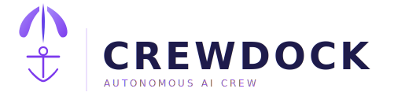
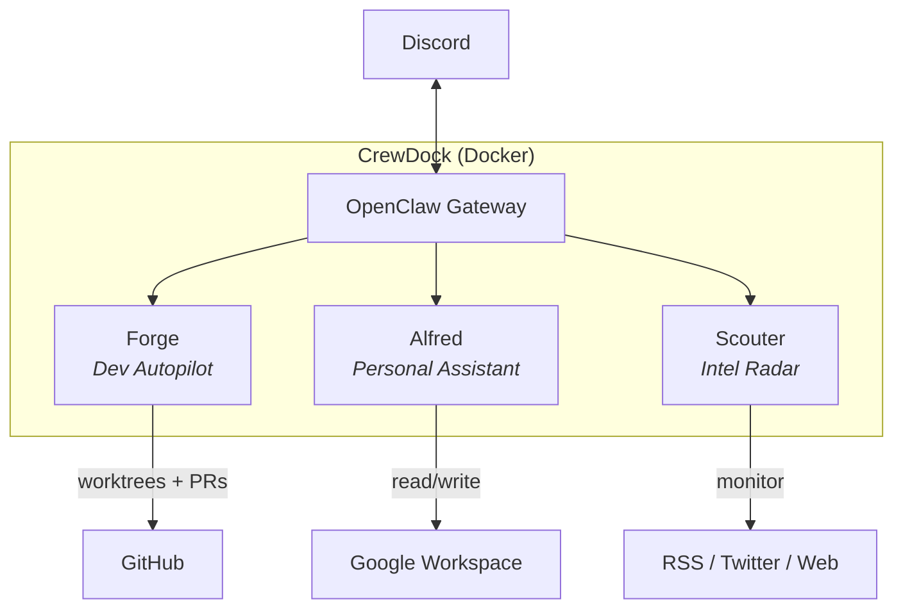

<p align="center">
  <picture>
    <source media="(prefers-color-scheme: dark)" srcset="brand/logo-horizontal.svg">
    <source media="(prefers-color-scheme: light)" srcset="brand/logo-horizontal-dark.svg">
    
  </picture>
</p>

<p align="center">
  A self-hosted AI crew that runs 24/7 on your server.<br>
  Three specialized agents working autonomously in Docker, built on <a href="https://github.com/openclaw/openclaw">OpenClaw</a>.
</p>

<p align="center">
  <a href="LICENSE"></a>
  <a href="https://www.docker.com/"></a>
  <a href="https://github.com/openclaw/openclaw"></a>
  <a href="https://buymeacoffee.com/dasirra"></a>
</p>

## Architecture



## What is CrewDock

CrewDock turns a Docker host into a 24/7 AI operations center. It runs
[OpenClaw](https://github.com/openclaw/openclaw) as the gateway, adds three
specialized agents, and wires everything to Discord so you can monitor and
interact from your phone.

The agents run on cron schedules or on demand. Each one has its own workspace,
config, and database. You deploy once and they take it from there.

## The Agents

### Alfred — Personal Assistant

Daily briefings and Google Workspace access (Gmail, Calendar, Tasks) via
Discord. On first message, Alfred walks you through setting your briefing
schedule. After that, it delivers a morning summary on cron and answers
workspace queries on demand.

### Forge — Dev Autopilot

Autonomous development agent. Picks up GitHub issues, writes code, and
opens PRs. Forge uses OpenClaw's [ACP](https://docs.openclaw.ai/acp)
(Agent Communication Protocol) to spawn isolated coding sessions that run
Claude CLI (`acpx`) inside the container. Each session gets its own
worktree, runs autonomously, and reports results back to Discord.

**How it works:**

1. A cron job fires on a configurable interval (default every 15m, disabled on first boot)
2. Forge checks which repos are due based on their schedule
3. For each repo, it fetches open issues (oldest first)
4. Filters out issues with active sessions, existing PRs, or exclude labels
5. Spawns an ACP session per issue (up to max concurrent) that invokes Claude CLI
6. Each session: reads the issue, creates a worktree, implements, tests, opens a PR
7. Results are announced on Discord

**Config example** (`config.json`):

```json
{
  "timezone": "America/New_York",
  "cron": {
    "enabled": false,
    "interval": "*/15 * * * *",
    "jobId": ""
  },
  "defaults": {
    "branch": "main",
    "agentId": "claude",
    "model": null,
    "schedule": "on-demand",
    "thread": true,
    "maxConcurrentSessions": 4,
    "maxAttempts": 3
  },
  "projects": [
    {
      "repo": "your-username/your-repo",
      "branch": "main"
    }
  ]
}
```

Projects inherit from `defaults` — only `repo` is required.

**Schedules:**

| Schedule | Behavior |
|---|---|
| `on-demand` | Manual trigger only |
| `always` | Every cron cycle |
| `HH-HH` | Hour range (e.g., `22-07` wraps midnight) |
| `HH-HH weekdays` | Monday–Friday only |
| `HH-HH weekends` | Saturday–Sunday only |

**Global defaults:**

| Setting | Default | Description |
|---|---|---|
| `branch` | `"main"` | Base branch for new worktrees |
| `agentId` | `"claude"` | ACP agent for sessions |
| `model` | `null` | Model override (`null` = agent default) |
| `schedule` | `"on-demand"` | Default schedule for projects |
| `thread` | `true` | Create a Discord thread per session |
| `maxConcurrentSessions` | `4` | Max active autopilot sessions globally |
| `maxAttempts` | `3` | Max retry attempts per issue |
| `cron.interval` | `"*/15 * * * *"` | Cron schedule when enabled |

**Project options:**

| Field | Required | Description |
|---|---|---|
| `repo` | Yes | GitHub repo (`owner/name`) |
| `branch` | No | Override default branch |
| `agentId` | No | Override default agent |
| `model` | No | Override default model |
| `schedule` | No | Override default schedule |
| `thread` | No | Override default thread setting |
| `enabled` | No | Toggle on/off (default: `true`) |
| `excludeLabels` | No | Issue labels to skip |
| `testCommand` | No | Custom test command |
| `setupInstructions` | No | Run before each session |

### Scouter — Intel Radar

Monitors AI/tech sources (RSS, Twitter/X, web pages) and drafts engagement
posts in your voice for Twitter/X. Never publishes automatically — all
drafts go through you on Discord.

**Sources config** (`config.json`):

```json
{
  "timezone": "America/New_York",
  "sources": {
    "twitter": {
      "schedule": "twice-daily",
      "list_id": "YOUR_X_LIST_ID",
      "max_results": 10
    },
    "rss": [
      { "name": "HackerNews Best", "url": "https://hnrss.org/best", "schedule": "every-4h" }
    ],
    "web": [
      { "name": "GitHub Trending", "url": "https://github.com/trending", "schedule": "daily-at-10" }
    ]
  }
}
```

Comes with 8 post templates: build logs, library reviews, news commentary,
original takes, quote tweets, replies, resource shares, and threads.

## Prerequisites

- [Docker](https://www.docker.com/) and Docker Compose
- `curl` and `jq` (used by the install wizard)

The install wizard walks you through everything else: Discord bots, GitHub
tokens, Claude credentials, and optional integrations. It validates each
credential before saving.

## Installation

```bash
git clone https://github.com/dasirra/crewdock.git
cd crewdock
./install.sh
```

The wizard will:

1. Install [gum](https://github.com/charmbracelet/gum) (TUI framework) if not present
2. Let you pick which agents to enable
3. Walk you through each integration (Discord, GitHub, Claude, Google Workspace, X/Twitter)
4. Validate credentials against their APIs in real time
5. Generate your `.env` and create runtime directories
6. Offer to start the container (`make up`) and authenticate an LLM provider (`make auth`)

**Power user alternative:** skip the wizard entirely.

```bash
cp .env.example .env
vim .env        # fill in your values
make up
make auth       # authenticate an LLM provider
```

### Reconfiguring

Run `./install.sh` again at any time to add agents, change tokens, or update
integrations. The wizard detects your existing `.env` and lets you modify it.

## Configuration

### Environment Variables

The install wizard generates `.env` for you. For manual setup, copy
`.env.example` to `.env` and fill in your values. See `.env.example` for the
full list of available variables and their descriptions.

## Commands

| Command | Description |
|---|---|
| `make up` | Build and start all services |
| `make down` | Stop all services |
| `make restart` | Restart all services |
| `make restart-gateway` | Restart only the gateway |
| `make logs` | Tail gateway logs |
| `make logs-all` | Tail all service logs |
| `make status` | Show running containers |
| `make auth` | Authenticate an LLM provider (interactive selector) |
| `make auth-anthropic` | Authenticate Anthropic OAuth |
| `make auth-codex` | Authenticate OpenAI Codex OAuth |
| `make version` | Show pinned, running, and latest versions |
| `make shell` | Open bash shell in the gateway container |
| `make cli` | Open interactive OpenClaw CLI |
| `make dashboard` | Auto-approve pending devices, print dashboard URL |
| `make onboard` | Run onboarding wizard (LLM + integrations) |
| `make config-preview` | Preview generated openclaw.json without Docker |
| `make clean` | Remove dangling Docker images |
| `make help` | Show all available commands |

## Project Structure

```
crewdock/
├── install.sh                     # TUI installation wizard
├── installer/                     # Wizard modules
│   ├── manifest.json              # Agent and integration definitions
│   ├── lib.sh                     # Shared helpers (output, env, gum wrappers)
│   ├── gum.sh                     # Gum detection and auto-install
│   ├── discord.sh                 # Discord bot setup + validation
│   ├── github.sh                  # GitHub PAT setup + validation
│   ├── claude.sh                  # Claude OAuth token setup
│   ├── gws.sh                     # Google Workspace credentials setup
│   └── xurl.sh                    # X/Twitter API setup + validation
├── agents/                        # Agent templates (tracked in git)
│   ├── forge/                     # Dev autopilot agent
│   ├── alfred/                    # Personal assistant agent
│   ├── scouter/                   # Intel radar agent
│   ├── USER.md                    # User profile shared across agents (gitignored)
│   └── USER.example.md
├── claude/                        # Claude CLI commands
├── init.d/                        # Boot scripts (run on container start)
├── home/                          # Persistent /home/node volume (gitignored)
│   ├── .openclaw/                 # Gateway config + agent workspaces
│   ├── .claude/                   # Claude CLI config
│   └── .config/                   # gh, gws, xurl credentials
├── docker-compose.yaml            # Core service definition
├── docker-compose.override.yaml   # Personal additions (gitignored)
├── Dockerfile                     # Base image + core tools
├── Dockerfile.local               # Personal tool additions (gitignored)
├── docker-entrypoint.sh           # Container entrypoint
├── Makefile                       # Build and management commands
└── .openclaw-version              # Pinned OpenClaw base image version
```

## Extending

### Custom Tools

Copy `Dockerfile.local.example` to `Dockerfile.local` and add your own tools:

```dockerfile
FROM openclaw-openclaw-gateway:latest

USER root
RUN apt-get update && apt-get install -y your-tools
USER node
```

### Additional Services

Copy `docker-compose.override.example.yaml` to `docker-compose.override.yaml`
and add services. Docker Compose merges it automatically. Both files are
gitignored so personal additions won't conflict with upstream updates.

## License

MIT
